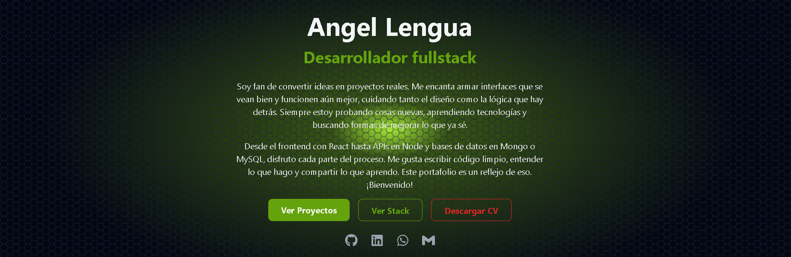

# 🖐️ Portfolio - Angel DEV

[](https://react.dev/)
[](https://www.typescriptlang.org/)
[](https://developer.mozilla.org/en-US/docs/Web/CSS)
[](https://www.framer.com/motion/)
[](https://vercel.com/)

---

¡Hola! Bienvenido/a a mi portafolio personal.  
Este sitio fue diseñado y construido desde cero para mostrar mis habilidades como **Desarrollador Full Stack**, enfocándome en el rendimiento, la escalabilidad y una experiencia de usuario moderna.

---

## 🚀 Tecnologías principales

- ⚛️ **React** + **TypeScript**
- 🎨 **TailwindCSS** + **CSS Puro** para estilos personalizados
- 🧩 **Framer Motion** para animaciones fluidas y modernas
- ⚙️ **Vite** como bundler de desarrollo rápido
- 📦 **Modular Architecture** para escalabilidad
- 🌐 **Vercel** para despliegue en producción
- 🧠 **Git** y **GitHub** para control de versiones

---

## 📸 Vista previa



---

## 🛠️ Funcionalidades principales

- 🌟 Diseño **responsivo** (adaptable a móviles, tablets y escritorios).
- 🚀 Navegación rápida y fluida entre secciones.
- 🎨 Animaciones sutiles para una experiencia moderna.
- 📂 Organización clara entre proyectos **Frontend**, **Backend** y **Fullstack**.
- ✨ Código optimizado y modular.

---

## ⚙️ Instalación local

Si deseas ejecutar este portafolio en tu máquina local:

```bash
# 1. Clona el repositorio
git clone https://github.com/ang-len-26/PORTAFOLIO-AngelDev.git

# 2. Entra al proyecto
cd PORTAFOLIO-AngelDev

# 3. Instala las dependencias
npm install

# 4. Inicia el servidor de desarrollo
npm run dev
```

## 🧩 Estructura del proyecto

- src/
- ├── assets/
- ├── components/
- │ ├── common/
- │ ├── layout/
- │ │ ├── Footer.tsx
- │ │ ├── Header.tsx
- │ │ └── Layout.ts
- │ └── sections/
- │ ├── HeroSection.tsx
- │ ├── ProjectsSection.tsx
- │ └── StackSection.tsx
- ├── context/
- │ └── ThemeContext.tsx
- ├── data/
- │ ├── projects.ts
- │ └── techStack.ts
- ├── hooks/
- ├── pages/
- │ ├── Home/
- │ │ └── index.tsx
- │ ├── Projects/
- │ │ ├── index.tsx
- │ │ └── ProjectCard.tsx
- │ └── Aboutme/
- │ └── index.tsx
- ├── routes/
- │ └── Routes.tsx
- ├── styles/
- │ └── global.css
- ├── utils/
- ├── App.tsx
- └── main.tsx

## 🎯Proximas mejoras

- 📬 Integrar un formulario de contacto funcional (emailJS o backend propio)
- 🗃️ Agregar más proyectos recientes
- 🔍 Mejoras SEO y tiempos de carga
- 📈 Sección de estadísticas de GitHub y stack más visual

## 📜 Licencia

Este proyecto está licenciado bajo la **Creative Commons Attribution-NonCommercial-NoDerivatives 4.0 International License**.

[](https://creativecommons.org/licenses/by-nc-nd/4.0/)

Consulta los detalles aquí: [https://creativecommons.org/licenses/by-nc-nd/4.0/](https://creativecommons.org/licenses/by-nc-nd/4.0/)

✨ Gracias por visitar mi portafolio ✨
Construido con pasión, código limpio y muchas ganas de seguir creciendo.
